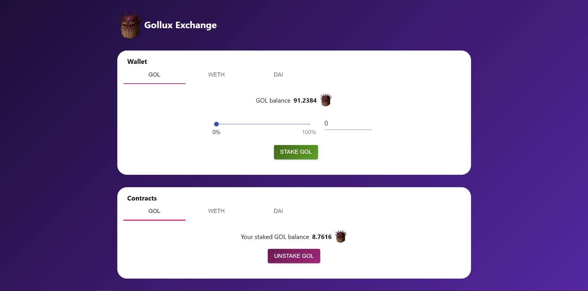

# Gollux Exchange DApp

## Description 
A decentralized application for yield farming, borrowing and lending. It allows you to:
- `stakeTokens`: Add any approved token to the farming contract for yeild farming, collateral, or whatever you want to do.
- `unStakeTokens`: Remove your tokens from the contract.
- `getUserTotalValue`: Get the total value that users have supplied based on calculations from the Chainlink Price Feeds. 
- `issueTokens`: Issue a reward to the users staking on your platform!

## Reference
 [Original Repo](https://github.com/PatrickAlphaC/defi-stake-yield-brownie-freecode)

## License
This project is licensed under the [MIT license](LICENSE).
